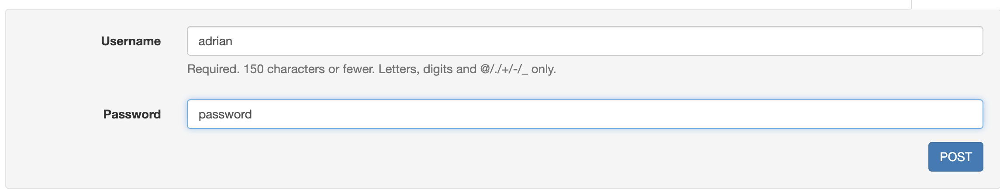
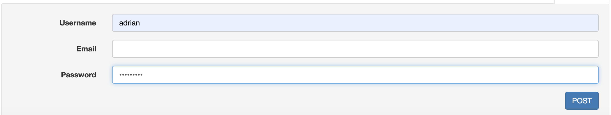
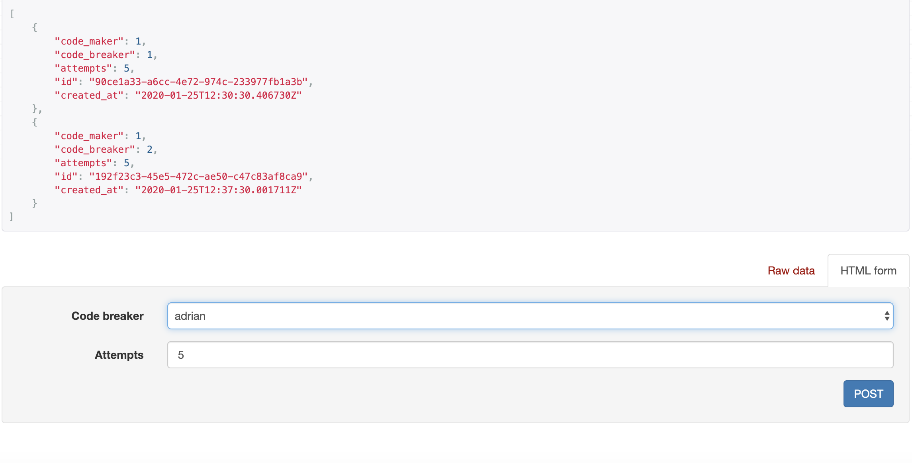
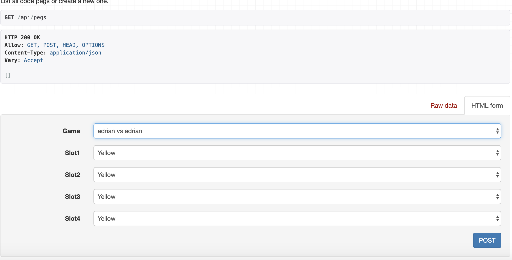

# Mastermind
Implementation of an API REST with **Django** + **PostgreSQL** for the game mastermind.

[](https://www.python.org/)

## Introduction
Mastermind is a code-breaking game for two
players. One player becomes the codemaker , the
other the codebreaker . The codemaker chooses a
pattern of four color code pegs (duplicates
allowed) and the codebreaker tries to guess it, in
both order and color.
Each guess is made by placing a row of color
code pegs on the decoding board. Once placed,
the codemaker provides feedback by placing from
zero to four key pegs in the small holes of the row
with the guess. A black key peg (small red in the
image) is placed for each code peg from the guess
which is correct in both color and position. A white
key peg indicates the existence of a correct color
code peg placed in the wrong position.

## Getting started
With these instructions you can run the API REST locally, or run it for a pre-production/production environment.

### Prerequisites
You will need dockers and dockers compose to be able to run the project easily.

You can find out how to install both at the following links:
[Docker](https://docs.docker.com/install/linux/docker-ce/ubuntu/) and [Docker compose](https://docs.docker.com/compose/install/)

### Deployment
After that, you'll be able to run the API REST with the following commands:

* For **development** environment:
   ```bash
   make dev
   ```
  or
  ```bash
  docker-compose -f docker-compose.dev.yml build
  docker-compose -f docker-compose.dev.yml up -d
  ```

* For **pre-production** environment:
  ```bash
    make preprod
  ```
  or
  ```bash
  docker-compose -f docker-compose.preprod.yml build
  docker-compose -f docker-compose.preprod.yml up -d
  ```

* For **production** environment:
  ```bash
    make prod
  ```
  or
  ```bash
  docker-compose -f docker-compose.prod.yml build
  docker-compose -f docker-compose.prod.yml up -d
  ```

#### Checking logs
To check the application logs, the following commands are useful:

```bash
docker ps
...
CONTAINER ID        IMAGE                              COMMAND                  CREATED             STATUS              PORTS                                                   NAMES
cf81984103dc        mastermind_api                     sh -c '/wait && ..."     3 days ago          Up 20 seconds       80/tcp
...
docker logs cf81984103dc
```

## Running the tests (Coverage included)
```bash
$ .../mastermind/: pytest
```
## Running pylint
```bash
$ .../mastermind/: pylint api/ code_peg/ game/
```
## Running black
```bash
$ .../mastermind/: black api/ code_peg/ game/
```

## Principal endpoints
* Auth: http://host:port/auth/login
* Users http://host:port/users
* Games http://host:port/games
* Games http://host:port/pegs

## Examples
### Creating a new game
On `/api/users`, creates a new user (you'll need two):

On `/auth/login/` Authenticate with the created user:

Create the new game on `/api/games`:

Submit the game solution on `/api/pegs`

With the other user, submit the another code peg.

### Checking the historic game.
On `/api/games` get the ID of the game.
On `/api/games/<ID>/historic`, you'll will see all the code pegs submitted.

## Built with
* Django
* PostgreSQL
* DjangoRestFramework

## Code style
* Black
* Pylint

## Authors
* **Adrián Carayol Orenes** - [LinkedIn](https://www.linkedin.com/in/adrian-carayol-orenes-027016108/) 